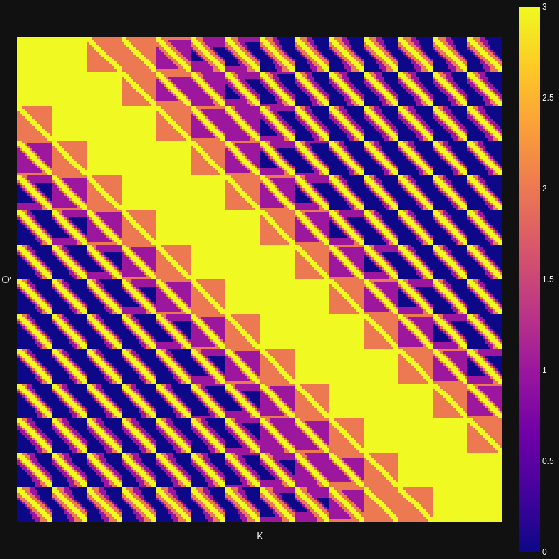
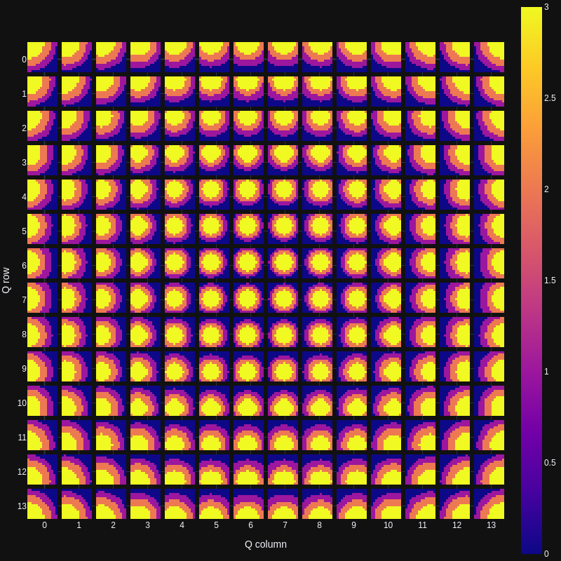

# Highlights
highlights, portfolio and information

## FishFormer - Research paper
[\<Overleaf\>](https://www.overleaf.com/project/61c9319359960803602a3e87)

## FiakFormer - Research paper
[\<Overleaf\>](https://www.overleaf.com/project/61750e891fd9f308b81a47f8)

## FishFormer++ - Research paper
[\<Overleaf\>]()

<!--  -->

> query-centered grid view

